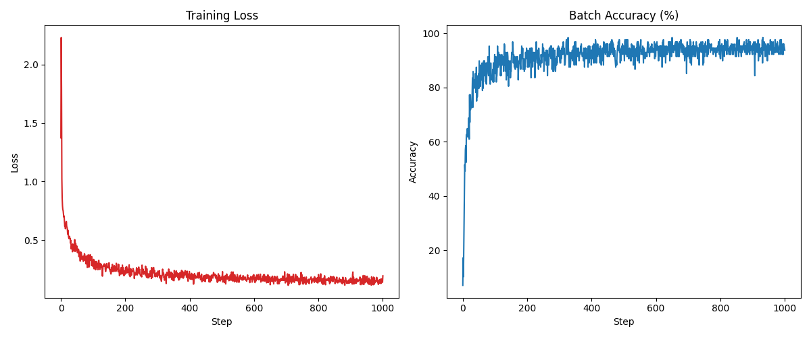

A simple neural network framework written in Python (though the language is unimportant here) only using numPy. This project was intended to learn more about neural networks, inspired by the 3B1B series, rather than have any sort of real-world applications. Currently, this is capable of training a MLP on the MNIST dataset (100,000+ params) to ~94% accuracy using MSE loss.
```
Fetching MNIST dataset...
Start training 

Iteration    0 | Loss: 1.3746 | Batch Accuracy: 7.03%
Iteration  100 | Loss: 0.2722 | Batch Accuracy: 89.84%
Iteration  200 | Loss: 0.2186 | Batch Accuracy: 92.19%
Iteration  300 | Loss: 0.1848 | Batch Accuracy: 94.53%
Iteration  400 | Loss: 0.1934 | Batch Accuracy: 93.75%
Iteration  500 | Loss: 0.1825 | Batch Accuracy: 93.75%
Iteration  600 | Loss: 0.1626 | Batch Accuracy: 96.09%
Iteration  700 | Loss: 0.1500 | Batch Accuracy: 95.31%
Iteration  800 | Loss: 0.2046 | Batch Accuracy: 90.62%
Iteration  900 | Loss: 0.1746 | Batch Accuracy: 92.19%
Iteration 1000 | Loss: 0.1938 | Batch Accuracy: 93.75%

Training complete
```
We can visualise this using matplotlib:


* Cross-Entropy Loss & Softmax.
* This currently doesn't support tensors with more than 2 dimensions, so N-dimensional matrix operations could be something to look into.
* Layer Normalisation.

